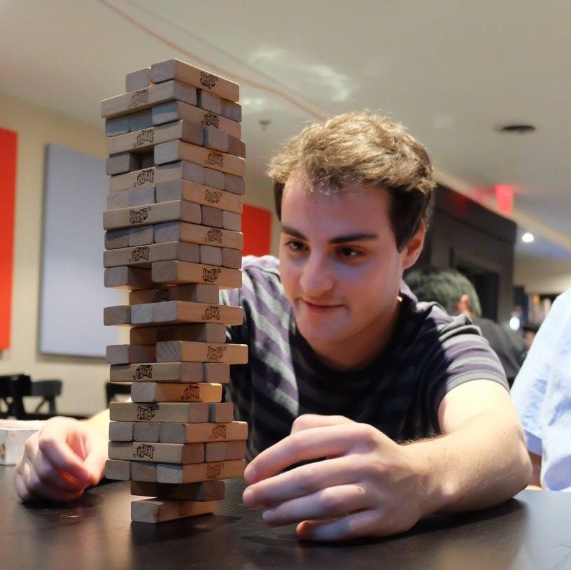

{:height="100px"}

Distributed air quality monitoring for urban environments.

### Why?
In the wake of rapid urbanization, a growing focus by municipalities is on addressing urban air quality, a huge factor in civilian health and quality of life. 

Unfortunately, researchers currently rely on a handful of permanent monitoring stations, coupled with developing complex models, in order to understand air quality variability in a city.  

The DENSE team aims to develop a scalable, self-sustaining, low cost device for monitoring of gas and dust based pollutants, which can be quickly deployed in large urban environments.

### Team

<table>
<col width="250px">

<tr>
<td></td>
<td>

<b>Evgeny</b> is a Mechatronics Engineering student focusing on software and network design for the project.

</td>
</tr>

<tr>
<td></td>
<td>

<b>Anthony</b> is in his final year of the Mechatronics Engineering program at the University of Waterloo. He is the lead mechanical designer for this project as well as supporting other areas.

</td>
</tr>

<tr>
<td></td>
<td><b>Adam</b> is studying Mechatronics Engineering at the University of Waterloo. His contributions to the project include hardware and software design. </td>
</tr>

<tr>
<td></td>
<td>

<b>Antony</b> is a Mechatronics engineer that specializes in electrical hardware design. He will focus on sensor integration and PCB development, as well as assist with mechnical design tasks.

</td>
</tr>
</table>
