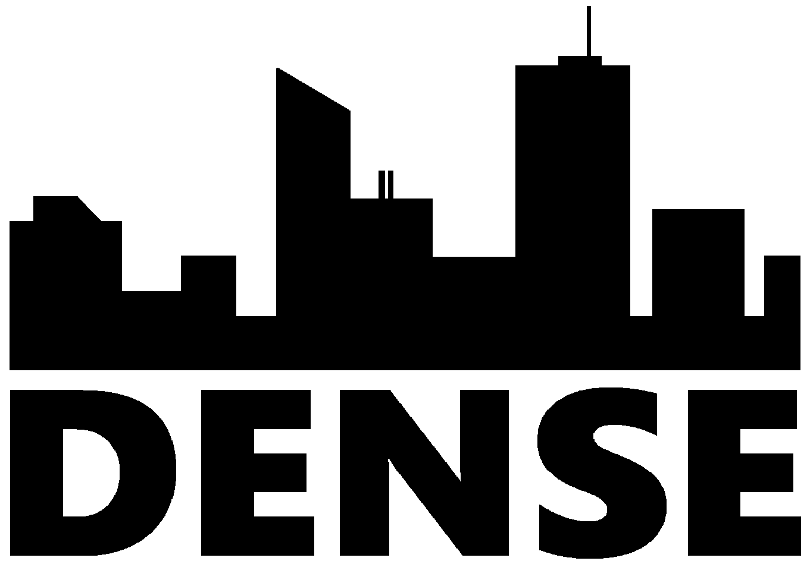

{:height="150px"}

Distributed air quality monitoring for urban environments.

##### Team

<table>
<col width="250px">

<tr>
<td></td>
<td>
It's not because things are difficult that we dare not venture. It's because we dare not venture that they are difficult.
</td>
</tr>

<tr>
<td></td>
<td>
Anthony is in his final year of the mechatronics engineering at the University of Waterloo. He is the lead mechanical designer for this project as well as supporting other areas.
</td>
</tr>

<tr>
<td></td>
<td>
It's not because things are difficult that we dare not venture. It's because we dare not venture that they are difficult.
</td>
</tr>

<tr>
<td></td>
<td>
It's not because things are difficult that we dare not venture. It's because we dare not venture that they are difficult.
</td>
</tr>
</table>
